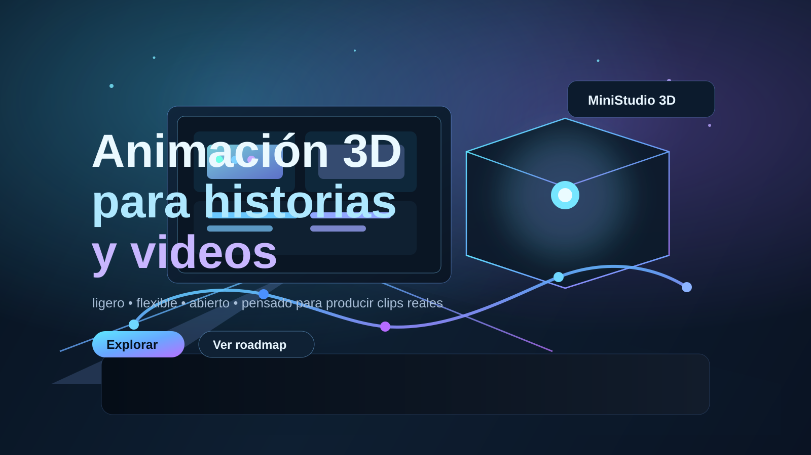

# MiniStudio 3D

<p align="center">
  
</p>

<p align="center">
  
  
  
  
</p>

MiniStudio 3D es un sistema de animación 3D para crear videos narrativos, tutoriales y clips de storytelling con personajes, escenarios y cámaras configurables. La idea es ofrecer una herramienta ligera, expresiva y práctica para producir contenido visual sin depender de pipelines pesados ni de hardware premium.

La visión del proyecto no es reemplazar a herramientas gigantes como Blender, sino crear una alternativa más directa, eficiente y accesible para producir escenas 3D con estilo propio, bajo consumo de sistema y con una curva de trabajo mucho más simple.

## Qué hace este proyecto

MiniStudio 3D permite:

- construir personajes 3D con apariencia estilizada,
- montar entornos cotidianos o temáticos,
- componer tomas con cámara y movimiento,
- definir recorridos y acciones,
- producir secuencias narrativas o educativas,
- exportar la vista como video.

El sistema está pensado para adaptarse a muchos tipos de historias: oficina, cyberpunk, fantasía, ciencia ficción, medieval, criaturas, robots, universos propios y cualquier situación que pueda construirse con modelos, props y composición visual.

## Filosofía del proyecto

- Estilo Blender, pero mucho más ligero.
- Interfaz 3D simple y directa.
- Cero dependencia de build pesado.
- Máxima creatividad con mínimos requisitos del sistema.
- Caja de herramientas útil para producción real y flujo rápido.
- Código abierto, pensado para mejorarse y compartirse.

## Objetivo principal

Minimizar la fricción entre idea y resultado final:

- facilidad de uso,
- flexibilidad artística,
- calidad visual razonable,
- bajo consumo de hardware,
- capacidad de generar clips útiles para redes, tutoriales y storytelling.

El proyecto busca un equilibrio útil entre potencia y simplicidad: sin quedarse corto en capacidad creativa, pero sin volverse un entorno pesado y complejo.

## Casos de uso

MiniStudio 3D puede utilizarse para:

- videos educativos de redes y ciberseguridad,
- escenas narrativas cortas,
- animaciones con personajes en contextos reales o fantásticos,
- tutoriales y explicaciones visuales,
- demostraciones de entornos de trabajo o operaciones,
- series o clips estilo low-poly con escenas reproducibles.

## Estado actual

La base funcional del proyecto ya incluye:

- render 3D con WebGL,
- personajes procedurales,
- entornos y props,
- selección y edición de elementos,
- vista de cámara y modos de seguimiento,
- cinemática por waypoints,
- timeline para tomas y acciones,
- grabación de video desde la escena.

La intención es seguir mejorando la herramienta con foco en calidad, producción y simplicidad de uso.

## Stack tecnológico

| Tecnología | Uso |
|---|---|
| HTML / CSS / JavaScript | UI y lógica del editor |
| ES Modules | Organización modular del proyecto |
| Three.js | Motor 3D y render |
| MediaRecorder | Grabación y exportación de video |
| Python (`serve.py`) | Servidor local para desarrollo |

## Estructura del repositorio

```text
Mini 3D/
├── index.html              # UI principal (import map, paneles, menús)
├── style.css               # Estilos del editor
├── serve.py                # Servidor local para desarrollo
├── assets/
│   └── mini3d-cover.svg
├── js/
│   ├── boot.js             # Punto de entrada (modal de inicio)
│   ├── main.js             # Orquestador del editor
│   ├── core.js             # Renderer, escena, cámara, OrbitControls
│   ├── state.js             # Estado central compartido
│   ├── render.js            # Loop de animación central
│   ├── dom.js               # Lookups DOM (byId memoizado)
│   ├── tickers.js           # Animaciones registradas por frame
│   ├── collision.js         # Colisiones y ley del piso
│   ├── undo.js              # Historial (snapshots JSON)
│   ├── catalog.js           # Catálogo de piezas spawneables
│   ├── trayDraw.js          # Dibujo de canaletas punto a punto
│   ├── construction.js      # Capa de construcción (pisos/paredes)
│   ├── projectFiles.js      # Guardar/abrir proyectos JSON
│   ├── environment.js       # Ambientes y presets
│   ├── lights.js / park.js / terrain.js   # Escenarios y luces
│   ├── startup.js           # Modal de arranque y accesos rápidos
│   ├── characters/          # Personajes
│   │   ├── characters.js    #   Rigs procedurales + gestos one-shot
│   │   ├── characterCreator.js  # Modal de creación (género, vestimenta)
│   │   └── anchors.js       #   Anclas de asiento (sillas)
│   ├── cinema/              # Narrativa temporal
│   │   ├── cinematics.js    #   Recorridos por waypoints y vistas
│   │   ├── timeline.js      #   Secuenciador de tomas y eventos
│   │   ├── quizTrack.js     #   Pista de carteles de pregunta (quiz)
│   │   ├── wizard.js        #   Asistente de escenas
│   │   └── navigation.js    #   A* de recorridos automáticos
│   ├── ui/                  # Interacción
│   │   ├── ui.js            #   Paneles y selector de modo Editar
│   │   ├── gizmo.js         #   Flechas/anillo de transformación
│   │   ├── selection.js     #   Registro de seleccionables
│   │   ├── multiselect.js   #   Ctrl+clic, marquesina, grupos
│   │   └── viewport.js      #   Vistas de cámara + vuelo al objetivo
│   ├── media/               # Capas sobre el video
│   │   ├── recorder.js      #   Grabación y exportación
│   │   ├── subtitles.js     #   Subtítulos en canvas WebGL
│   │   └── quiz.js          #   Cartel de pregunta con reloj
│   └── office/              # Entorno oficina (por subsistema)
│       ├── group.js         #   Grupos compartidos y mini racks
│       ├── walls.js         #   Tabiques, puertas, texturas
│       ├── materials.js     #   Materiales
│       ├── furniture.js     #   Escritorios, sillas, PCs…
│       ├── serverRoom.js    #   Sala de servidores
│       ├── lounge.js        #   Juntas, gerencia, bar, cocina
│       ├── network.js       #   Mini rack, canaletas, APs WiFi
│       ├── city.js / alarm.js / hackerHouse.js
│       ├── geoCache.js      #   Caché de primitivas
│       └── index.js         #   Orquestador del layout
├── scenes/                  # Escenas de ejemplo (.json)
├── tools/                   # Validadores y tests (Node)
│   ├── check-imports.cjs    #   Resuelve todas las rutas de import
│   ├── check-scc.js         #   Guardia de ciclos de dependencia
│   ├── p7-test.mjs          #   Suite funcional del catálogo/edición
│   ├── p7-loadtest.mjs      #   Test de carga de proyecto vacío
│   └── test-geo-cache.js    #   Test de caché de geometría
├── vendor/                  # Three.js local (única copia en uso)
├── SKILL.md                 # Guía del proyecto y reglas de trabajo
├── GLM.md                   # Informe de estado del proyecto
├── CHANGELOG.md             # Registro de cambios
├── mini3d_mejoras.md        # Backlog priorizado
└── AGENTS.md                # Reglas para agentes (fuente única)
```

> Importante: `app.js` en la raíz es código heredado y no debe tomarse como referencia de arquitectura del proyecto actual.

## Cómo ejecutar

### Opción 1: servidor local con Python

```bash
python serve.py
```

Luego abrir la URL que muestre el servidor en el navegador.

### Opción 2: servidor estático

Se puede servir la carpeta con cualquier servidor web estático compatible con archivos HTML, CSS y JS.

## Roadmap sugerido

1. Mejorar la timeline y la secuenciación de tomas.
2. Ampliar animaciones y transiciones entre acciones.
3. Mejorar la exportación de video y la calidad de grabación.
4. Agregar más entornos, props y escenarios reutilizables.
5. Mejorar la personalización de personajes y cámaras.
6. Simplificar la creación de escenas para usuarios no expertos.
7. Mantener el enfoque de bajo costo de sistema y alta creatividad.

## Contribución

El proyecto está pensado como base abierta para seguir creciendo. Cualquier mejora en estas áreas es bienvenida:

- rendimiento,
- calidad visual,
- edición de animaciones,
- nuevos entornos y props,
- mejor manejo de cámaras,
- exportación y pipeline final.

## Licencia

Este proyecto se mantiene como un esfuerzo de código abierto y no busca monetización. La idea es mejorar la herramienta, compartirla y hacerla útil para otras personas con objetivos similares.

## Cierre

MiniStudio 3D busca ser una herramienta práctica para contar historias con 3D sin volver el proceso pesado ni técnico. La meta no es solo “hacer 3D”, sino lograr un flujo útil, expresivo y accesible para generar videos reales con una buena relación entre creatividad, rendimiento y simplicidad.

Si te interesa el proyecto, podés probarlo, usarlo, mejorarlo y construir sobre esta base.
